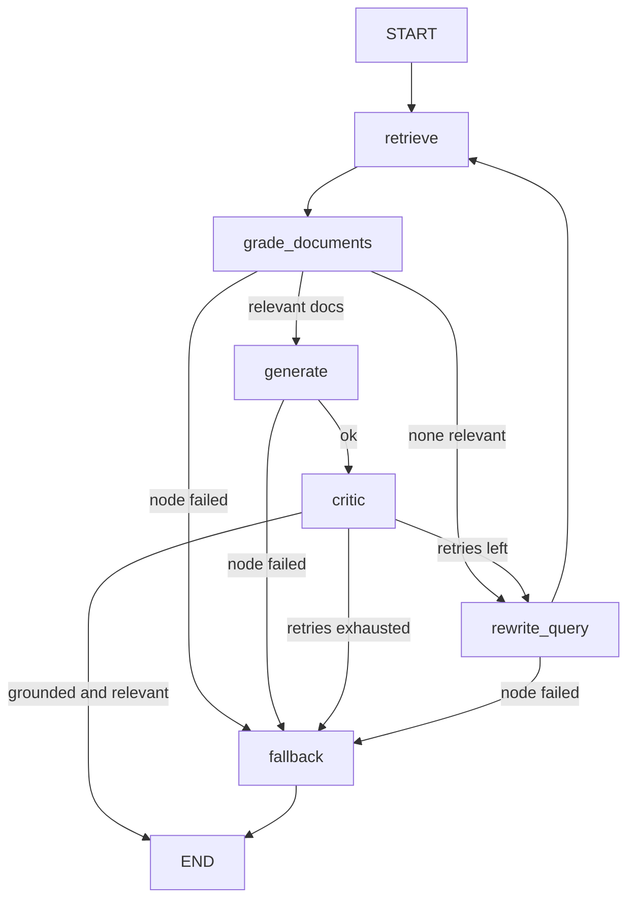

# Ballast

Ground, guard, and grade your LLM apps so they don't capsize into hallucination.

Three composing LLM-engineering subsystems over one shared core:

1. **Self-healing RAG** (`rag/`) - a LangGraph stateful graph that retrieves, grades its documents,
   generates a cited answer, critiques that answer for groundedness and relevancy, and either
   re-retrieves with a rewritten query or declines gracefully instead of hallucinating.
2. **Guardrails gateway** (`gateway/`) - middleware wrapping the RAG that enforces input guardrails
   (size, PII, secrets, prompt injection), output guardrails (schema, toxicity, topicality), and a
   configurable YAML policy layer (must-cite, no personalized/medical/legal advice). Blocks short to
   a safe fallback and can auto-retry with a correction.
3. **Eval CI/CD** (`eval/`) - a golden Q&A set, faithfulness / relevancy / hallucination / refusal /
   context-precision / latency / cost metrics, a local gate that fails the build on regression, a
   committed metrics ledger, and a trend dashboard.

The RAG knowledge base is a **public, non-sensitive** finance/investing corpus: educational
documents adapted from federal public-domain sources (SEC/investor.gov, IRS, CFPB, FDIC, Treasury,
BLS) plus a handful of the author's own methodology notes, each with per-file provenance
frontmatter (see `corpus/README.md`). No private data of any kind belongs in this repo.

Design notes and the case study: https://caskeycoding.com/case-studies/ballast. The essay on why it says "I don't know": https://caskeycoding.com/blog/ballast-an-llm-that-says-i-dont-know.

## Architecture

The self-healing RAG graph (`rag/graph.py`):



The full request path: `input guardrails -> RAG graph -> output + policy guardrails`, with an audit
trail, cost metering, and a per-run trace on every call.

## Stack

Python 3.11 - LangGraph - Claude API (anthropic SDK) behind a swappable `core.llm.LLMClient` -
sentence-transformers embeddings (hashing fallback) - Chroma or in-memory vector store - Pydantic.
The Anthropic key is read from AWS Secrets Manager at runtime (env var override for local dev).

## Quickstart

```bash
# 1. install (editable, with dev tools)
python -m pip install -e ".[dev]"

# 2. provide a key: either AWS creds so Secrets Manager resolves ai-blog/anthropic-api-key,
#    or set a local override
cp .env.example .env        # then optionally set ANTHROPIC_API_KEY for local dev

# 3. ask a question through the full gateway + RAG stack (it indexes the corpus in-process)
make ask Q="Why does diversification reduce risk?"
```

### No `make`? Use the module forms

Every target is a thin wrapper, so on Windows or anywhere without `make` you can call the modules
directly (this is the supported path on those machines):

```bash
python -m ballast.rag.ask "Why does diversification reduce risk?"   # full gateway + RAG, cited answer
python -m ballast.rag.ask "Should I buy this stock?" --show-trace   # also print the node-by-node run
python -m ballast.core.ingest                                       # load corpus/*.md into the store
python -m ballast.eval.run_cli --limit 5                            # run part of the golden set
python scripts/local_ci.py                                          # the full local gate
python -m pytest                                                    # the full test suite, no API key needed
```

## Commands

```bash
make ask Q="..."   # ask the gateway-wrapped RAG a question (add --show-trace via the module)
make ingest        # load corpus/*.md into the vector store
make eval          # run the golden set, write metrics + append the ledger (LIMIT=N for a subset)
make eval-gate     # check the latest eval run against thresholds (exit non-zero on regression)
make dashboard     # render the metrics trend dashboard to eval/dashboard/index.html
make local-ci      # the merge gate: secret scan, dep audit, ruff, mypy, pytest, eval gate
```

## Use as a library

Ballast is a package, not just a CLI. Wrap the gateway around your own corpus and call it from your
app; `process` returns the answer, its citations, whether a guardrail blocked it, and the full audit
trail.

```python
from ballast.core.trace import Trace
from ballast.rag.ask import build_gateway

trace = Trace(run_id="my-app")
gateway = build_gateway(trace)                 # real Claude client, key from Secrets Manager
resp = gateway.process("How does compounding work?")

print(resp.answer.text)                        # the grounded answer
print(resp.answer.citations)                   # [{title, source, url, chunk_id}, ...]
print(resp.blocked, [e.rule for e in resp.audit if e.action == "block"])
```

To drive it in tests or offline with no API key, inject a fake client:

```python
from ballast.core.testing import FakeLLMClient

gateway = build_gateway(trace, base_client=FakeLLMClient(["a scripted answer"]))
```

This is exactly how the test suite exercises the whole stack without a key.

## Configuration

Strategy and guardrail options are config-driven (`core.config.Settings`, via env or `.env`), so the
eval matrix can vary them without code edits: `retrieval` (vector | hybrid), `rerank`,
`query_transform` (none | multi_query | hyde), `vector_store` (memory | chroma), `embedder`,
`max_retries`, and the gateway hook stack itself (`pre_hooks` / `post_hooks`, composed by name via
`gateway.compose`). The default pre-hook stack includes both LLM-backed input classifiers
(`injection-llm`, `advice`); the LLM-backed output guards (`toxicity`, `topicality`) are opt-in
per deployment via `post_hooks`.

## A note on CI

GitHub Actions is not used. The merge gate runs locally via `make local-ci` (the eval gate fails the
build when the hallucination rate or injection block rate breaches its threshold, p95 latency
regresses, or the newest ledger entry is stale relative to HEAD), with a committed metrics ledger
(`eval/history.jsonl`) carrying the trend across sessions.

## Status

Specs in `specs/DESIGN.md`; the build queue is `specs/BACKLOG.md`, drained one item per run by the
local backlog loop.

## License

MIT for the source code (see `LICENSE`). The knowledge-base documents under
`corpus/` carry their own per-file provenance and license in frontmatter: most
are U.S. federal government works in the public domain (17 U.S.C. 105), and
the methodology notes are the repository author's own original educational
content.
